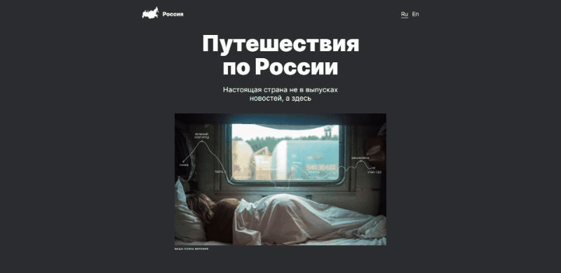

# Проект: Путешествие по России

**Проектная работа по курсу "Веб разработчик" сервиса онлайн обученя "Яндекс практикум"**

[Ссылка на страницу проекта](https://freyrskept.github.io/russian-travel/)

## Краткое описание:

Одностраничный сайт описывающий красоты нашей страны. На сайте описаны конкретные места, с которыми можно ознакомится по дополнительным ссылкам.
с испольованием инструментов адаптиции под разлиные устройства.

## Используемые технологии и функционал:

**HTML 5**

 * Разметка по правилам БЭМ Nested
 * Семантические теги

**CSS**

 * flexbox
 * grid
 * Позиционирование
 * Адаптивная разметка под экраны различных устройств
 * БЭМ Nested
 * Media queries

 ## Рефакторинг в будущем ##

* Встроить в сайт JavaScript
* Добавить английскую версию

**Figma**

* [Ссылка на макет в Figma](https://www.figma.com/file/5S2WSbEFL6awjVWJ0NWL8Q/Sprint-3_-Russia-_-desktop-mobile?node-id=28503%3A0)